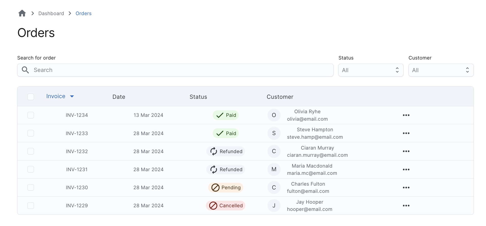
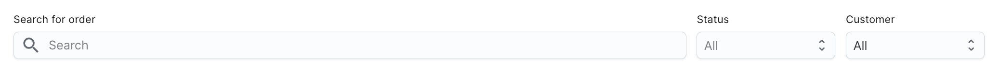
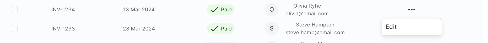
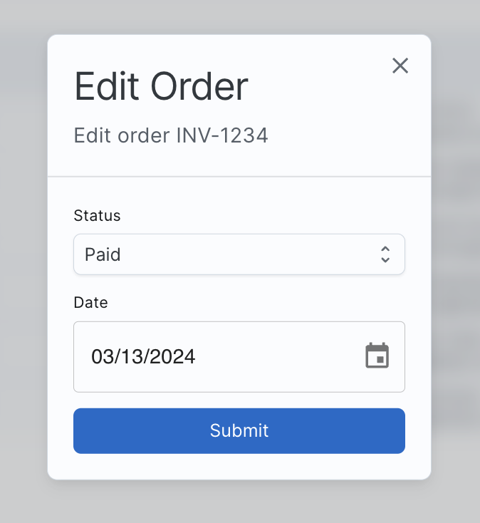

# React + TypeScript + Vite + Firebase

Sample orders dashboard with data fetching from a firebase backend



### Installation

To install the project, just run the following command:

```bash
yarn install
```

### Configuration

Create a `.env` file in the root of the project by duplicating the `.env.example` file and filling in the necessary values.

```bash
cp .env.example .env
```

### Running the project

```bash
yarn dev
```

## Features

### Migrate Orders

To migrate orders, just use the following command:

```bash
yarn run migrate-orders
```

### Filtering

You can filter orders by status using the dropdown on the top right corner of the page.



### Editing

You can edit an order by clicking on the edit button on the right side of the order row.



It will open a modal where you can edit the order status and date.



### Testing strategy

To test the project, multiple kind of tests can be used :

- **Unit tests** for individual functions using [jest](https://jestjs.io/) or [mocha](https://mochajs.org/) (here no function are complex enough to require testing, as it's just a basic CRUD app)

- **e2e tests**, with [cypress](https://www.cypress.io/) or [playwright](https://playwright.dev/) for example to test whole workflows (for example the order edition flow). These tests are interesting to run if a mock firestore database is used, as querying the real database everytime the tests are run can be costly, especially in a CI/CD environment.

Here no integration tests are written, as the app is quite simple and no complex backend-only logic is present. They could be useful to test cloud functions workflows for example.

To test individal components and review their UI, [storybooks](https://storybook.js.org/) can be created to test them in isolation, for example for the `OrderTable` or `OrderList` component.

### Future Improvements

- Simple hosting with firebase hosting to test a live version of the dashboard without having to run it locally
- Add a CI/CD pipeline to automate the testing and deployment of the app
- Add order creation and deletion to test the whole range of CRUD operations
- Improve UX with action feedback (notification or toast after successful order edition for example) and loading spinners when necessary
- Better error handling in case of network failure or database error
- Pagination on the orders collection to avoid always loading all orders
